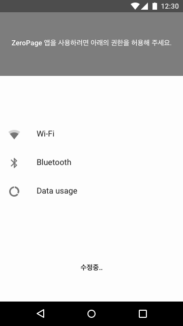
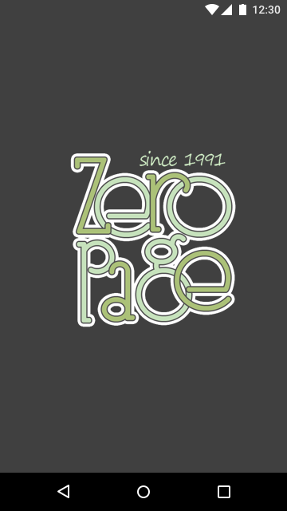

# Artboards

This is an autogenerated file showing all the artboards. Do not edit it directly.

## Material

## PermissionRequestActivity@0.0x

## Splash@0.0x

## dark-status-bar@0.0x

## main-status-bar@0.0x

